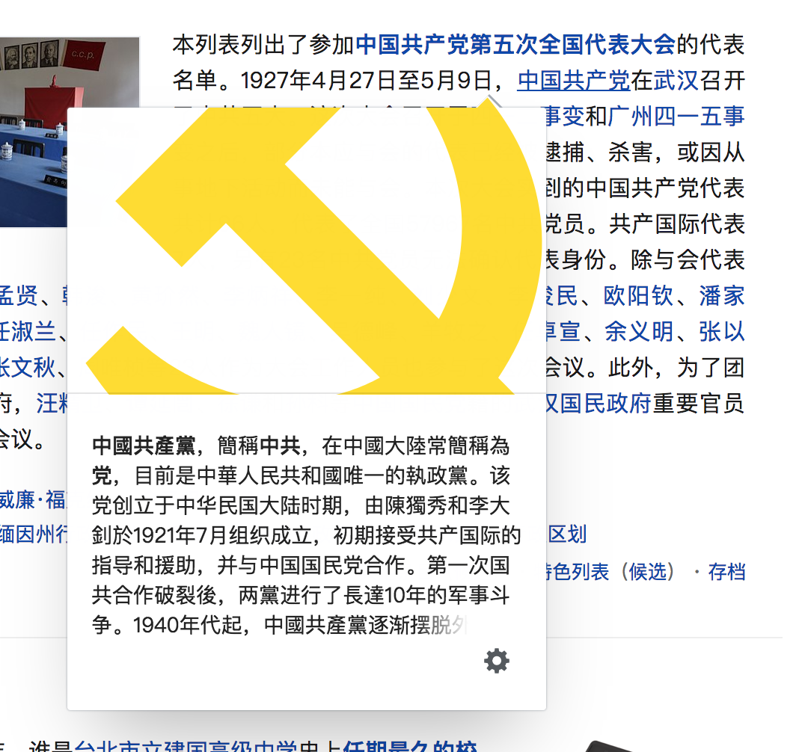

# Intelligent-annotation-system
智能批注系统

## 目录

[文档编辑规范](#文档编辑规范)

[一、需求分析](#需求分析)

 [1. 规范符号批注的种类及用法](#规范符号批注的种类及用法)

  [1.1 确定批注方式](#确定批注方式)

  [1.2 问题列表](#问题列表)

 [2. 规范文字批注的类型及用法](#规范文字批注的类型及用法)

 [3. 智能抽取书中某个段落，展示以往所有学生及教师提交的批注](#智能抽取书中某个段落，展示以往所有学生及教师提交的批注)

 [4. 提供能够方便教师授课的批注操作界面](#提供能够方便教师授课的批注操作界面)

 [5. 智能分析批注较优秀的书籍及学生作品，并予以展示](#智能分析批注较优秀的书籍及学生作品，并予以展示)

 [6. 提供优秀学生读者排行及优秀书籍排行](#提供优秀学生读者排行及优秀书籍排行)

 [7. 统计所有批注，并能进行数据挖掘及应用分析](#统计所有批注，并能进行数据挖掘及应用分析)

[二、技术栈](#技术栈)

 [1. 前端](#前端)

 [2. 后台](#后台)

 [3. 存储](#存储)

 [4. 移动端](#移动端)

[三、数据库结构](#数据库结构)

[四、接口](#接口)

## 文档编辑规范

* 添加内容前先检查目录，确定将要添加的内容不会和现有内容重复
* 如果插入了新的**标题**，请在目录相应位置增加**链接**，GitHub支持的格式为`[目录名](#标题名)`
* 内容分析时如果**引入**了外部文档，请使用`>`标签表示引用
* **特殊符号**或**变量名**使用两个\`符号包裹，如`tensorflow`
* 如果需要**插入图片**，将图片放在`images`目录下，引入图片的格式为``

## 需求分析

### 规范符号批注的种类及用法

> 直线“—”画在生字或需要解释的词语下，用以批注时注音或解词
> 圈字码①②③用来标示自然段的序号，便于查找内容
> 波浪线“~~~~~~~~”画在自己欣赏、或是文章中的关键语句下面， 以便加深记忆、理解
> 圈点“。。。 。。”标在文中的重点词或优美词语下面
> 三角号“Δ Δ Δ ”标出句子的关键词
> 自己阅读到有疑问的地方可以批注“？” 并写出自己的疑问
> 感叹号“！ 用在自己有感叹或惊奇的语句旁边，可以抒写所感
> 分段号“//”用来划分段落，可以附注书写段落大意
> 分层号“/”用来划分层次，可以附注书写层次大意

#### 确定批注方式

* 用户选中部分内容后弹出浮动选项栏以供选择[^为什么选中后弹出？]

* 选项包括“注释”、“喜欢”、“提问”、“重点”四项（可以设计成图标或符号），点击后为选中内容添加对应批注符号
  * “注释”功能可拥有二级菜单“注音”、“释义”（可以设计成图标或符号）
  * “注音”将在选定内容顶部标注汉语拼音
  * “释义”将对接百度百科，提供名词解释和词条跳转功能，添加了释义的内容将更改为特定样式（具体样式需要设计），并在点击时弹出释义卡片，如
  * 
* “提问”功能将在侧面打开（大屏）或跳转到（小屏）[问题列表](#问题列表)

#### 问题列表

* 该列表显示当前选中内容（或包含该内容）的所有提问
* 右上角设置“添加问题”按钮
* 问题页面应该能看到选中的内容，如果选中的是词语、短语，则应该能看到上下文（简单通过字数判断）
* 点击问题可进入详情
  * 详情可以查看完整问题
  * 详情可以查看已有的回答并点赞
  * 详情可以添加自己的回答
  * 每个用户在同一问题下只能添加一个答案
  * 用户可以修改和删除自己的回答

### 规范文字批注的类型及用法

### 智能抽取书中某个段落，展示以往所有学生及教师提交的批注

### 提供能够方便教师授课的批注操作界面

### 智能分析批注较优秀的书籍及学生作品，并予以展示

### 提供优秀学生读者排行及优秀书籍排行

### 统计所有批注，并能进行数据挖掘及应用分析

## 技术栈

### 前端

* Vue.js
* Vue VueRouter
* Vue VueX

### 后台

* Python

* Python Flask
* Python pymysql

### 存储

* MySQL

### 移动端

* 待定

## 数据库结构

## 接口

[^为什么选中后弹出？]: 设计成选择内容后直接弹出是为了同时适配手机和电脑的网页版，手机浏览器内无法使用右键点击（后面也许会想到更好的交互逻辑）.